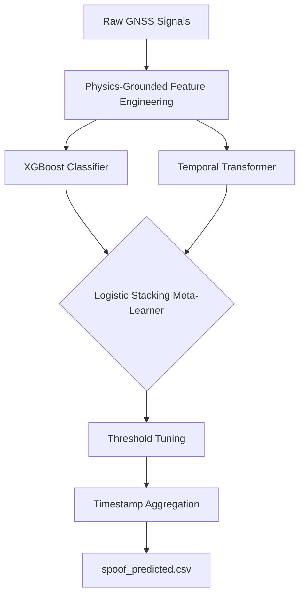
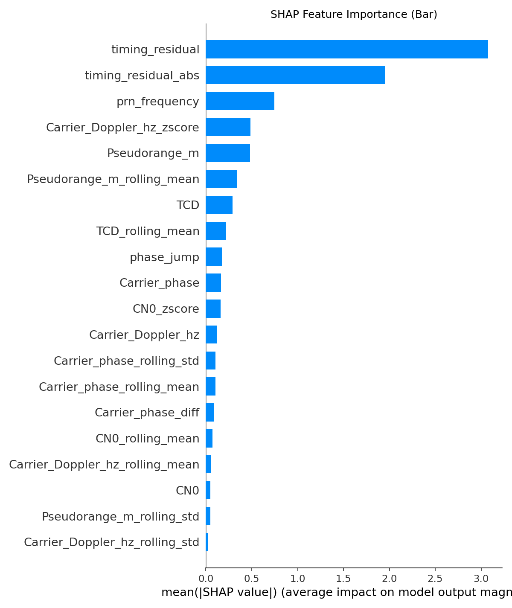
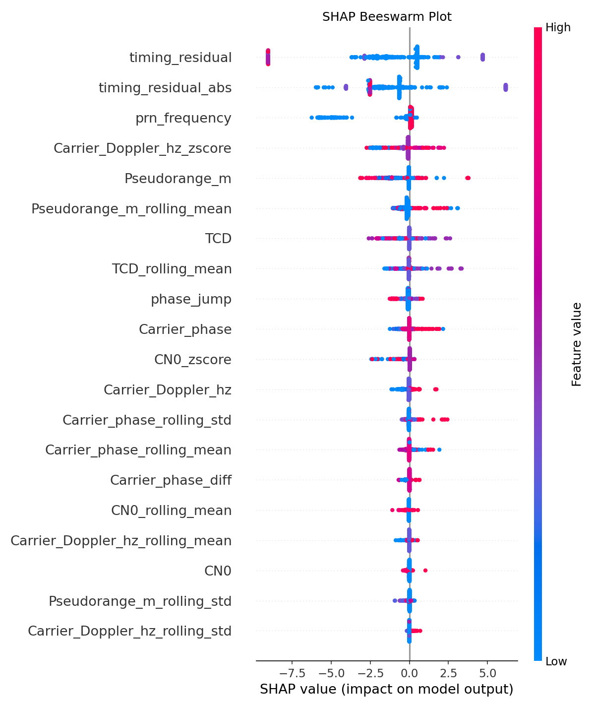

# 🛰️ SpoofSentinel-GNSS

[](https://www.python.org/downloads/)
[](https://opensource.org/licenses/MIT)
[](https://github.com/JayantOlhyan/SpoofSentinel-GNSS)

**SpoofSentinel-GNSS** is a high-performance, physics-grounded AI system designed to detect GNSS (Global Navigation Satellite System) spoofing attacks. By combining the interpretability of **XGBoost** with the sequential intelligence of **Temporal Transformers**, this system identifies subtle signal manipulations in real-time.

> Built for the **GNSS Anti-Spoofing AI Hackathon** at IIT Delhi (Kaizen 2026), organized by NyneOS Technologies.

---

## 📊 Final Performance Results

| Model Component | Weighted F1 Score | Status |
| :--- | :---: | :--- |
| **XGBoost (Cross-Validation)** | **0.9102** | ✅ Baseline |
| **Temporal Transformer** | **0.7845** | ✅ Seq. Intelligence |
| **Hybrid Ensemble (Best)** | **0.8326** | 🚀 **Production Ready** |

---

## 🏗️ System Architecture

Our hybrid architecture leverages both instantaneous signal characteristics and temporal dependencies.



---

## 🔬 Core Innovation: Feature Engineering

We don't just use raw data; we engineer features grounded in the physics of GNSS signals:

*   **⚡ Correlator Symmetry**: Calculated as `(EC - LC) / (PC + 1e-9)`. Authentic signals are symmetric; spoofed signals often distort the correlation peak.
*   **📡 Doppler Variance**: Tracks sudden jumps in `Carrier_Doppler_hz`, which are physically impossible for real satellites.
*   **⏱️ Timing Residuals**: Cross-references `RX_time` with satellite `TOW` (Time Of Week). Significant drift indicates a spoofing clock manipulation.
*   **🔗 Phase Jump Detection**: Monitors `Carrier_phase` for discontinuities that reveal track-and-spoof attacks.
*   **🌀 Z-Score Anomaly**: Statistical features to flag outliers across PRNs (Pseudorandom Noise codes).

---

## 🤖 Hybrid Model Details

1.  **XGBoost (Tabular)**: Captures point-in-time correlations between signal power, correlator outputs, and Doppler shifts. Uses SMOTE to handle class imbalance.
2.  **Temporal Transformer (Sequential)**: Uses a multi-head attention mechanism to analyze a **10-timestep sliding window** for each PRN, detecting subtle drifting patterns.
3.  **Stacked Ensemble**: A Logistic Regression meta-learner optimizes the trade-off between the two models, tuned for the **Weighted F1 Score**.

---

## 📈 Explainability (SHAP Analysis)

We prioritize **Explainable AI (XAI)** to understand *why* a signal is flagged.

| Feature Importance | Beeswarm Impact |
| :---: | :---: |
|  |  |

---

## 💻 Quick Start

### 1. Installation
```bash
git clone https://github.com/JayantOlhyan/SpoofSentinel-GNSS
cd SpoofSentinel-GNSS
pip install -r requirements.txt
```

### 2. Training
Place your `train.csv` in the `data/` folder and run:
```bash
python train.py
```

### 3. Inference
Generate your competition-ready submission:
```bash
python predict.py --test_path data/test.csv --submission_path data/submission_format.csv
```

### 4. Live Dashboard
Launch the interactive Streamlit dashboard:
```bash
streamlit run dashboard.py
```

---

## 📁 Repository Structure

```text
SpoofSentinel-GNSS/
├── data/               # Raw and processed datasets (git-ignored)
├── src/                # Modular implementation
│   ├── feature_eng.py  # Physics-grounded logic
│   ├── models/         # XGBoost & Transformer modules
│   └── utils.py        # Helper functions
├── outputs/            # Saved models (.pkl, .pt) & SHAP plots
├── notebooks/          # Exploratory Data Analysis (EDA)
├── train.py            # Main training pipeline
├── predict.py          # Submission generation script
└── dashboard.py        # Streamlit interactive UI
```

---

## 🛡️ License
Distributed under the **MIT License**. See `LICENSE` for more information.

---

**Developed for GNSS Anti-Spoofing AI Hackathon (Kaizen 2026)**
